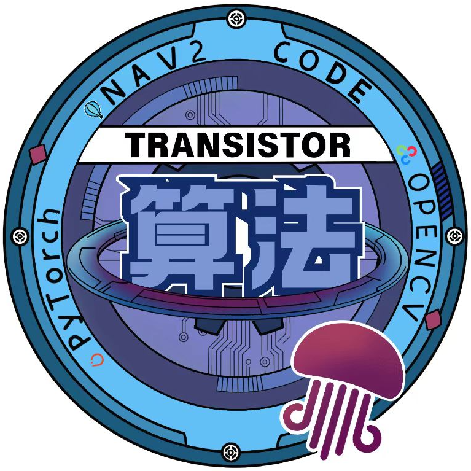

# 北极熊导航Quick-Start

> 写在前面：
>
> 该文档为旧版README.md,如果你从深北莫的远端仓库拉取，请食用这篇攻略

<div style="text-align: center;">
  
</div>

本仓库为北航Transistor战队2026赛季哨兵机器人的工作空间，参考了深北莫北极熊战队开源的导航功能包，丰富了假裁判系统等功能，同时做了一些修改。

本文档旨在帮助导航小白快速上手北极熊导航功能包。

## 0. 前言

- Ubuntu 22.04
- ROS Humble

接下来的操作将在一个工作空间下进行，请先在主文件夹创建工作空间。

```bash
mkdir -p ~/nav2_ws && cd ~/nav2_ws
```

**2025.8.18更新：可以使用Tutorial中的一口气全克隆将所有环境装好，但环境可能并不完整，建议去一口气全克隆中提供的北极熊官方链接。**

## 1. 安装

### 1. pb2025_sentry_nav

内部存放了里程计、重定位、导航插件等多个程序，是整个导航功能包的核心。

```bash
git clone --recursive https://github.com/SMBU-PolarBear-Robotics-Team/pb2025_sentry_nav.git src/pb2025_sentry_nav
```

### 2. rmu_gazebo_simulator

内部存放了该导航功能包与gazebo相关的部分，同时其中的``dependencies.repos``文件可以帮助配置``rmoss``（可以理解为RM官方的gazebo仿真插件）和``sdf``相关（可以理解为与gazebo仿真中机器人模型相关的工具）。

先配置相关环境。

```bash
sudo pip install vcstool2
```
```bash
pip install xmacro
```

然后正式拉取远程仓库。

```bash
git clone https://github.com/SMBU-PolarBear-Robotics-Team/rmu_gazebo_simulator.git src/rmu_gazebo_simulator
```
```bash
vcs import src < src/rmu_gazebo_simulator/dependencies.repos
```

如果您的ubuntu没有配置英伟达驱动，那么仿真将奇卡无比，**请移步飞书文档中的算法通用配置显卡驱动与英伟达容器工具箱**。

### 3. 先验点云地图

先验点云用于``small_gicp_relocalization``功能包重定位，由于点云文件体积较大，故不存储在 git 中，请前往[FlowUs](https://flowus.cn/lihanchen/share/87f81771-fc0c-4e09-a768-db01f4c136f4?code=4PP1RS)下载。

然后将下载目录中的四个点云文件（即``*.pcd``文件）移动到``~/nav2_ws/src/pb2025_sentry_nav/pb2025_nav_bringup/pcd/simulation``中。

### 4. small_gicp第三方库系统安装

``small_gicp_relocalization``功能包依赖于``small_gicp``这一第三方库进行开发。笔者习惯于将系统安装的第三方库放在主文件夹的自定义文件夹下编译安装，接下来的命令将如此做。

```bash
mkdir -p ~/tools && cd ~/tools
```
```bash
sudo apt install -y libeigen3-dev libomp-dev
```
```bash
git clone https://github.com/koide3/small_gicp.git
```
```bash
cd small_gicp
```
```bash
mkdir build && cd build
```
```bash
cmake .. -DCMAKE_BUILD_TYPE=Release && make -j
sudo make install
```

## 2. 编译

```bash
cd ~/nav2_ws
```
```bash
rosdep init # 如果初始化过rosdep请忽略这一步
```
```bash
rosdep install -r --from-paths src --ignore-src --rosdistro $ROS_DISTRO -y
```
```bash
colcon build --symlink-install --cmake-args -DCMAKE_BUILD_TYPE=Release
```

## 3. 运行

### terminal 1

```bash
ros2 launch rmu_gazebo_simulator bringup_sim.launch.py
```

此处记得**点击gazebo界面中左下角的启动键**，不然将无法发布机器人内部各个零件间的tf变换。

### terminal 2

#### 导航模式

```bash
ros2 launch pb2025_nav_bringup rm_navigation_simulation_launch.py \
world:=rmul_2025 \
slam:=False
#注：上述命令使用了联盟赛的3v3地图，方便后续行为树决策部分使用
```

#### 建图模式

```bash
ros2 launch pb2025_nav_bringup rm_navigation_simulation_launch.py \
slam:=True
```

具体的更改地图、调参等功能请移步``tutorial.md``查看。