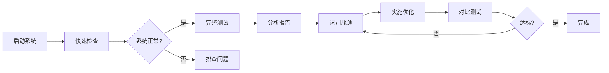

# 🚀 导航系统性能测试套件

## 📦 工具概览

本测试套件用于评估和优化导航系统的性能，包含以下工具：

| 工具 | 用途 | 耗时 |
|------|------|------|
| `quick_check.sh` | 快速状态检查 | ~2秒 |
| `performance_test.sh` | 完整性能测试 | ~30-60秒 |
| `process_analysis.md` | 架构分析文档 | - |
| `TESTING_GUIDE.md` | 详细测试指南 | - |

---

## ⚡ 快速开始

### 1️⃣ 启动系统（两个终端）

**Terminal 1 - 仿真器**:
```bash
cd ~/nav2_ws
source ./install/setup.bash
ros2 launch rmu_gazebo_simulator bringup_sim.launch.py
```
**⚠️ 记得点击Gazebo的启动按钮！**

**Terminal 2 - 导航**:
```bash
cd ~/nav2_ws
source ./install/setup.bash
ros2 launch pb2025_nav_bringup rm_navigation_simulation_launch.py \
    world:=rmul_2025 \
    slam:=False \
    use_composition:=True
```

---

### 2️⃣ 快速检查（Terminal 3）

```bash
cd ~/nav2_ws
./quick_check.sh
```

**输出示例**:
```
========================================
  快速性能检查
========================================

✓ 检测到导航系统正在运行

📊 进程统计
  nav2_container       : 1
  point_lio           : 1
  terrain_analysis    : 2
  joy相关             : 2
  rviz2               : 1
  gazebo              : 2
  ────────────────────────
  总ROS2进程数     : 9

💻 资源使用快照
进程                   CPU%     MEM%    内存(MB)
─────────────────────────────────────────────
component_container    15.2%    2.3%     450.2
pointlio_mapping        8.5%    1.8%     320.5
...
总计                   74.8%      -    2560.9
```

---

### 3️⃣ 完整测试（可选）

```bash
cd ~/nav2_ws
./performance_test.sh
```

测试完成后会生成详细报告目录：
```
performance_test_results_YYYYMMDD_HHMMSS/
├── PERFORMANCE_REPORT.md    # 📊 综合报告
├── resource_usage.csv       # 📈 详细数据
├── process_count.txt        # 📋 进程统计
├── node_list.txt            # 📋 节点列表
├── topic_latency.txt        # 📡 话题延迟
└── tf_frames.pdf            # 🌲 TF树图
```

---

## 📊 性能基准（参考值）

### 当前配置（use_composition:=True）

| 指标 | 当前值 | 优化目标 |
|------|--------|----------|
| **进程总数** | 9-10个 | 6-7个 ⬇️30% |
| **ROS2节点数** | ~18个 | ~18个 |
| **总内存** | 2.5-4 GB | 2-3 GB ⬇️20% |
| **容器内节点** | 14个 | 17-18个 ⬆️ |

### 关键进程资源使用

| 进程 | CPU% | 内存(MB) | 备注 |
|------|------|----------|------|
| nav2_container | 10-20% | 400-600 | ✅ 已合并14个节点 |
| point_lio | 5-15% | 300-400 | ⚠️ 建议保持独立 |
| terrain_analysis | 3-8% | 80-120 | 🔧 可合并 |
| terrain_analysis_ext | 3-8% | 80-120 | 🔧 可合并 |
| gazebo | 20-40% | 800-1500 | ✅ 仿真器正常 |

---

## 🎯 优化建议速查

### 可立即优化的节点 ✅

1. **terrain_analysis + terrain_analysis_ext**
   - 合并到 nav2_container
   - 预计减少2个进程
   - 内存节省: ~10-15%

2. **ign_sim_pointcloud_tool** (仅仿真)
   - 合并到 nav2_container
   - 减少1个进程

3. **joy_node + pb_teleop_twist_joy_node**
   - 合并为 teleop_container
   - 减少1个进程（或合并到nav2_container）

### 不建议合并 ❌

- **point_lio**: 里程计源头，保持独立保证鲁棒性
- **rviz2**: GUI进程，独立运行
- **gazebo**: 外部仿真器

---

## 📖 详细文档

### 🔍 [TESTING_GUIDE.md](./TESTING_GUIDE.md)
完整的测试指南，包含：
- 详细的测试步骤
- 结果解读方法
- 对比测试流程
- 常见问题解答

### 📊 [process_analysis.md](./process_analysis.md)
架构分析和优化方案，包含：
- 当前架构详细分析
- 三种优化方案对比
- 实施步骤指南
- 性能收益预测

---

## 🔧 工具使用

### quick_check.sh

**功能**: 2秒内快速检查系统状态

**使用场景**:
- ✅ 验证系统是否正常启动
- ✅ 快速查看资源使用
- ✅ 检查composable容器状态
- ✅ 日常调试

**命令**:
```bash
./quick_check.sh
```

---

### performance_test.sh

**功能**: 完整的30秒性能基准测试

**测试项目**:
1. 进程统计（详细列表）
2. ROS2节点枚举
3. Composable节点清单
4. 30秒资源监控（CPU/内存）
5. 话题延迟测试
6. TF树性能分析
7. 生成综合报告

**命令**:
```bash
./performance_test.sh
```

**输出**: `performance_test_results_YYYYMMDD_HHMMSS/` 目录

---

## 📈 性能测试流程



---

## 🎓 测试检查清单

### 启动前 ☑️
- [ ] 已source ROS2环境
- [ ] Gazebo仿真器运行中
- [ ] 已点击Gazebo启动按钮
- [ ] 导航系统完全启动（等待3-5秒）

### 测试中 ☑️
- [ ] 观察quick_check输出是否正常
- [ ] 进程数量符合预期（9-10个）
- [ ] CPU使用率合理（<100%）
- [ ] 内存使用稳定（2-4GB）

### 测试后 ☑️
- [ ] 查看生成的报告
- [ ] 记录关键指标
- [ ] 对比历史数据
- [ ] 规划优化方向

---

## 🐛 故障排查

### 问题：脚本提示"导航系统未运行"
```bash
# 检查进程
pgrep -af nav2_container

# 重新启动导航
ros2 launch pb2025_nav_bringup rm_navigation_simulation_launch.py \
    world:=rmul_2025 slam:=False use_composition:=True
```

### 问题：ros2命令找不到
```bash
# Source环境
source ./install/setup.bash
source /opt/ros/humble/setup.bash
```

### 问题：内存/CPU异常高
```bash
# 查看详细进程信息
top -p $(pgrep -d',' -f ros2)

# 检查是否有节点崩溃重启
ros2 node list
```

---

## 📞 进一步的工具

### 实时监控
```bash
# 持续监控（每秒刷新）
watch -n 1 './quick_check.sh'

# htop监控特定进程
htop -p $(pgrep -d',' -f "nav2_container|point_lio|rviz2")
```

### ROS2调试工具
```bash
# 查看话题频率
ros2 topic hz /red_standard_robot1/odom

# 查看节点信息
ros2 node info /red_standard_robot1/nav2_container

# 查看参数
ros2 param list /red_standard_robot1/nav2_container

# 计算图可视化
rqt_graph
```

### TF工具
```bash
# 查看TF树
ros2 run tf2_tools view_frames

# 实时TF监控
ros2 run tf2_ros tf2_monitor

# 查看特定变换
ros2 run tf2_ros tf2_echo map odom
```

---

## 📚 相关资源

- **ROS2文档**: https://docs.ros.org/en/humble/
- **Nav2文档**: https://navigation.ros.org/
- **性能调优**: https://docs.ros.org/en/humble/Tutorials/Demos/Intra-Process-Communication.html

---

## 🤝 贡献

如果你发现问题或有改进建议：
1. 创建Issue描述问题
2. 提交Pull Request
3. 更新测试文档

---

## 📝 版本历史

- **v1.0** (2025-11-09)
  - 初始版本
  - 包含quick_check和performance_test
  - 完整测试文档

---

## 📄 许可证

Apache License 2.0 - 与项目主仓库保持一致

---

**维护者**: Transistor战队导航组  
**最后更新**: 2025-11-09
